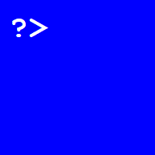

[![Contributors][contributors-shield]][contributors-url]
[![Issues][issues-shield]][issues-url]

<!-- PROJECT LOGO -->
<br />
<div align="center">
  <a href="https://github.com/MEth0/FLOPS-Farm">
    
  </a>

<h3 align="center">FLOPS Farm</h3>

  <p align="center">
    Incremental game
    <br />
    <a href="https://github.com/MEth0/FLOPS-Farm"><strong>Explore the docs »</strong></a>
    <br />
    <br />
    <a href="https://MEth0.github.io/FLOPS-Farm">▶️Play now</a>
    ·
    <a href="https://github.com/MEth0/FLOPS-Farm/issues">Report Bug</a>
    ·
    <a href="https://github.com/MEth0/FLOPS-Farm/issues">Request Feature</a>
  </p>
</div>

<!-- TABLE OF CONTENTS -->
<details>
  <summary>Table of Contents</summary>
  <ol>
    <li>
      <a href="#about-the-project">About The Project</a>
      <ul>
        <li><a href="#built-with">Built With</a></li>
      </ul>
    </li>
    <li>
      <a href="#getting-started">Getting Started</a>
      <ul>
        <li><a href="#prerequisites">Prerequisites</a></li>
        <li><a href="#installation">Installation</a></li>
      </ul>
    </li>
  </ol>
</details>

<!-- ABOUT THE PROJECT -->

## About The Project

<!-- [![Product Name Screen Shot][product-screenshot]](https://MEth0.github.io/FLOPS-Farm) -->

Small game made for The Microsoft Global Hackathon.


### Built With

[![React][react.js]][react-url]

<!-- GETTING STARTED -->

## Getting Started

### Prerequisites

- node

### Installation

1. Install NPM packages
   ```sh
   npm install
   ```
2. Start dev
   ```sh
   npm start
   ```

<!-- MARKDOWN LINKS & IMAGES -->
<!-- https://www.markdownguide.org/basic-syntax/#reference-style-links -->

[contributors-shield]: https://img.shields.io/github/contributors/MEth0/FLOPS-Farm.svg
[contributors-url]: https://github.com/MEth0/FLOPS-Farm/graphs/contributors
[issues-shield]: https://img.shields.io/github/issues/MEth0/FLOPS-Farm.svg
[issues-url]: https://github.com/MEth0/FLOPS-Farm/issues

<!-- [product-screenshot]: images/screenshot.png -->

[react.js]: https://img.shields.io/badge/React-20232A?logo=react&logoColor=61DAFB
[react-url]: https://reactjs.org/
